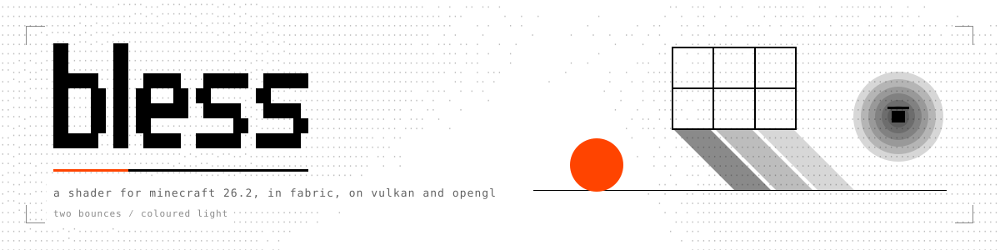
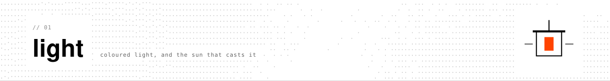
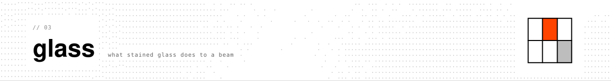
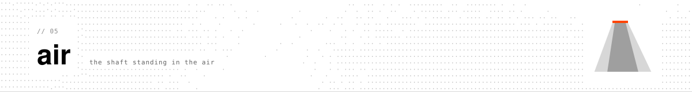

<picture> <source media="(prefers-color-scheme: dark)" srcset="design/readme/header-dark.svg">  </picture>

<!-- the two dynamic badges answer "repo not found" while this repo is private, and release needs a tag; uncomment them the day each is true. -->

    
<!--   -->

`bless` does its shading as a fabric client mod rather than a shader pack, targeting minecraft 26.2. it renders inside the game's own render graph, which is why it can skip iris and optifine entirely and work on both vulkan and opengl. the feature set: coloured light, a path trace with two bounces across a voxel copy of the world, sun shadows, volumetric air, light passing through stained glass, reflections off water, metal and glass, rain-wet ground, and adaptive exposure. the mod menu screen exposes each effect as a toggle and each parameter as a slider, and nearly all of it responds live to F3+T.

development happened on an apple m4, with measurements taken at every change. at 1920 by 1200 on that machine the full look runs about 5.5 ms per frame; per-effect costs are tabulated below.

<!-- SHOWCASE IMAGES: put your screenshots here, one per line, the chapel first. -->

## what it does

| effect | key | what you see |
|---|---|---|
| coloured light | `colored_light` | every emitter has a colour: a torch warm, a soul lantern cold, a sea lantern cyan, froglights ochre, verdant and pearlescent. the light flood-fills a voxel volume around you and spills onto the walls |
| the bounce | `voxel_gi` | a two-bounce path trace through that volume. a red wall bleeds onto a white floor, light creeps round a corner, a sea lantern climbs the wall behind it |
| sun shadows | `sun_shadows` | a depth map from the sun. stairs, slabs, walls and fences cast their real shape, and the map redraws only when the sun or you move |
| the air | `volumetric_light` | sun shafts through openings, lantern glow hanging in the air, a thin height fog that pools in hollows |
| sun rays | `sun_rays` | screen-space rays when the sun is in view |
| light through glass | `glass_light` | the sun and lantern light take the colour of the stained glass they pass through, panes included |
| reflections | `water_reflections`, `metal_reflections`, `glass_reflections` | water with a ripple and the sun's glint; iron, gold, diamond, copper, polished deepslate and their kin tinted by their own colour; glass, faint and stronger at angles |
| wetness | `wetness` | rain darkens ground open to the sky and puddles reflect; it dries over a minute |
| the eye | `auto_exposure` | a diamond corridor stops blinding, a cave brightens over a second |
| contact shadows and occlusion | `contact_shadows`, `ambient_occlusion` | the dark under a ledge and in a corner |
| haze | `haze` | a distance veil in the sky's colour, thicker at night |
| the colour | `mode` | a warm grade, a soft bloom with a coloured spill, optional grain, and fxaa at the end |

## the look

<picture> <source media="(prefers-color-scheme: dark)" srcset="design/readme/01-light-dark.svg">  </picture>

<!-- SHOWCASE IMAGE: coloured light, the lantern gallery or the colour doors -->

<picture> <source media="(prefers-color-scheme: dark)" srcset="design/readme/02-bounce-dark.svg">  </picture>

<!-- SHOWCASE IMAGE: the bounce room, or two suns -->

<picture> <source media="(prefers-color-scheme: dark)" srcset="design/readme/03-glass-dark.svg">  </picture>

<!-- SHOWCASE IMAGE: the stained chapel at noon -->

<picture> <source media="(prefers-color-scheme: dark)" srcset="design/readme/04-water-dark.svg">  </picture>

<!-- SHOWCASE IMAGE: the mirror pool, or rain -->

<picture> <source media="(prefers-color-scheme: dark)" srcset="design/readme/05-air-dark.svg">  </picture>

<!-- SHOWCASE IMAGE: the fog gully at sunset -->

## install

1. minecraft 26.2 with fabric loader and fabric api. mod menu is optional; it adds the settings screen (there is also a keybind).
2. drop `bless-0.2.0.jar` in `mods/`.
3. put a `bless.json` in `config/`. the mod reads it once at startup, and a missing file means everything off. the release carries one with everything on.
4. for the whole look, run the vulkan backend (video settings, graphics backend). on opengl you get the colour grade, bloom, grain and fxaa; the depth stage, everything from shadows to the bounce, is vulkan for now.
5. on a mac, set fullscreen mode to borderless. exclusive fullscreen starts the vulkan window at half the panel's pixels and never resizes.

## settings

configuration sits in `config/bless.json` and in the mod menu screen. F3+T reloads the colour knobs; everything else is read at startup. what ships in the release config matches the values tuned on the m4.

| key | default | range | what it does |
|---|---|---|---|
| `mode` | `bloom` | `off`, `identity`, `grade`, `bloom` | the colour chain. bloom includes the grade |
| `grade_strength` | 1.0 | 0 to 2 | the warm grade's weight |
| `bloom_threshold`, `bloom_strength` | 0.8, 0.32 | | the soft glow's edge and weight |
| `spill_threshold`, `spill_strength`, `spill_radius` | 0.55, 0.35, 6 | | the coloured light spill: keyed on saturated bright pixels |
| `grain`, `grain_strength` | off, 0.03 | | animated midtone grain |
| `fxaa`, `fxaa_strength` | off, 0.75 | | anti-aliasing at the end of the chain |
| `auto_exposure`, `exposure_target`, `exposure_min`, `exposure_max`, `exposure_speed` | off, 0.3, 0.5, 2.5, 1.5 | | the eye: the mean luminance it pulls toward, its clamps, its speed per second |
| `contact_shadows`, `contact_strength`, `contact_reach`, `contact_steps` | off, 1, 1, 4 | | short screen-space shadows under things |
| `ambient_occlusion`, `ao_samples`, `ao_radius`, `ao_strength` | off, 12, 1, 1 | | corners darken |
| `haze`, `haze_distance`, `haze_strength`, `haze_tint`, `haze_night`, `haze_color` | off, auto, 0.22, 0.25, 0.35, `#b9c6d4` | | the distance veil |
| `water_reflections`, `reflection_strength`, `glint_strength` | off, 0.45, 0.6 | | water |
| `metal_reflections`, `metal_strength` | off, 0.18 | | metal blocks, plus anything in the tag `bless:reflective` |
| `glass_reflections`, `glass_strength` | off, 0.6 | | glass blocks and panes, plus the tag `bless:glass` |
| `colored_light`, `light_strength`, `light_tint` | off, 0.35, 0.25 | | the flood-filled coloured light |
| `sun_shadows`, `shadow_strength`, `shadow_span`, `shadow_resolution` | off, 0.55, 128, 2048 | | the sun's depth map: how dark, how far, how fine |
| `voxel_gi`, `gi_strength`, `gi_rays`, `gi_distance`, `gi_bounces`, `gi_sky`, `gi_emissive`, `gi_scale`, `gi_checkerboard` | off, 1, 4, 24, 2, 1, 1, 2, off | | the bounce. the m4 runs 2 rays, 16 blocks, strength 0.6, checkerboard on |
| `volumetric_light`, `volume_strength`, `volume_density`, `volume_steps`, `volume_distance`, `volume_glow` | off, 1, 0.006, 20, 64, 1 | | the air |
| `sun_rays`, `sun_rays_strength` | off, 1 | | |
| `glass_light`, `glass_tint_strength` | off, 1 | | needs sun shadows. 0.7 is a wash, 1 is stained glass at full voice |
| `wetness`, `wet_strength`, `wet_dry_seconds` | off, 0.7, 60 | | |
| `diagnostics_path` | null | an absolute path | writes a status json every frame: counters, skip reasons, the last error. send it with a bug report |

## the showcase and the gallery

the mod ships with two data packs of vanilla blocks, there so each effect can be judged from the angle where it reads best before you choose what stays enabled.

`showcase/` holds fifteen rooms arranged on a stone path, a feature per room: a sundial for shadow angles, a lantern gallery with every emitter, a mirror pool with metal pads, a glass house, a colour-bleed room, a diamond corridor for the eye, a cave, a grove, a fog gully, a nether stage, two suns, seven colour doors, a brick parlour, a stained chapel and a slit hall for sun stripes. every room is sealed against the sky, so block light is all you see.

`gallery/` is a single building: a skylit hall with a pool, with fifteen lit rooms branching off it, running from a cornell box and a stained chapel through three furnished rooms, a fog stair, a hall of mirrors, a lava chamber and a dark closet where the eye can adapt. overhead, a balcony looks the full length of the hall for depth.

drop either folder into a superflat creative world's `datapacks/`, `/reload`, then `/function rmls_showcase:build` or `/function rmls_gallery:build`, and `/function rmls_showcase:go/<room>` or `/function rmls_gallery:go/<room>` to teleport to a room's viewpoint. the readme in each pack enumerates its rooms.

## what it costs

numbers taken on an apple m4 at 1920 by 1200 on vulkan, gpu time per frame, median across 900 frames of a heavy scene: a full room of mobs and blocks from the household mods.

| | ms |
|---|---|
| no shader | 5.0 |
| everything on | 10.6 |

per effect, measured in a torch-lit room: the bounce at the m4 settings 1.3, the air 0.5, sun rays 0.2, glass light 0.3, wetness under 0.1, fxaa 0.05, the eye 0.1. at its full defaults (4 rays, 24 blocks) the bounce costs 5.1, and that is the budget a bigger card would put toward it.

## how it works

two hooks into the game's frame graph. the first fires early, after opaque terrain and before the hand clears the depth buffer: a depth stage rebuilds positions and normals out of depth, then computes shadows, occlusion, reflections, the bounce and the air as half-resolution masks resolved across the frame. the second fires late and applies the colour chain as a post effect: grade, bloom, spill, grain, fxaa.

a single voxel volume backs both the coloured light and the bounce: 128 by 64 by 128 blocks centred on you at a block per texel, stored in two 1024 by 1024 atlases, rebuilt by a worker thread every two seconds from a snapshot the render thread gathers over several frames. the light atlas holds a flood fill seeded at every emitter, colour preserved through glass. the voxel atlas carries albedo and flags, and the bounce traces rays through it with a dda, bouncing twice, with the sun arriving through the shadow map. a temporal pass plus three edge-aware blurs tidy the result.

the shadow map itself is a depth-only mesh of nearby blocks, rebuilt on a worker as chunks arrive and leave, with partial blocks entering as their collision boxes. alongside it, whenever glass light is enabled, a tint map rendered from the sun's viewpoint folds in the colour of every pane.

materials come from observation, not heuristics: scanning the loaded chunks produces the list of every metal, glass and water-surface block, and those are drawn as geometry into a mask before the reflection stage chooses what reflects. grass never glints.

## building

java 25, gradle wrapper, fabric loom. `./gradlew build` writes `build/libs/bless-0.2.0.jar`. the settings screen compiles against mod menu's jar found in a minecraft instance's `mods/` folder; point `TK_INSTANCE` at any instance that has one. the mod refuses `runClient`; the bench runs it in an isolated instance instead.

## the bench

all the numbers cited above were produced by an isolated headless harness: it stages a client and a server, builds a fixture scene, holds the camera still, and reads gpu timestamps, while checking the mod's own status json for errors and skipped frames. the harness lives in its own repository, and it is the proof every change here passed before any player saw it.

## thanks

the lod study behind the far terrain work took from distant horizons and voxy. the bounce was first drafted on an rtx 3060 ti, then ground down for the m4.

## license

mit.
